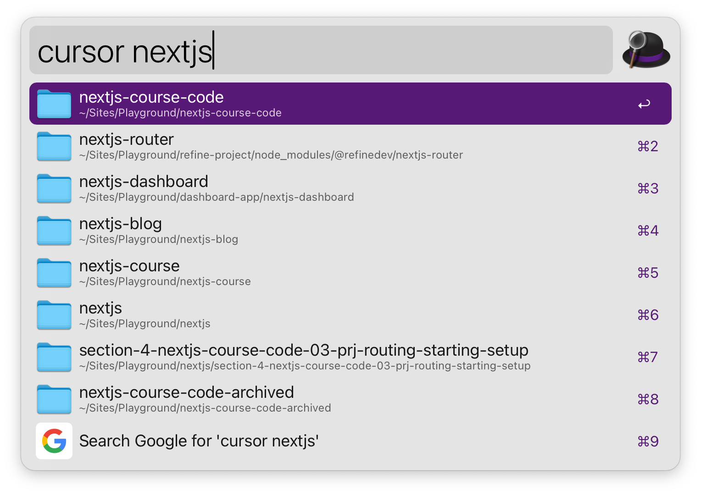

# alfred-open-with-cursor

An Alfred workflow for opening code folders with Cursor, the AI-powered code editor.

## Description

This Alfred workflow allows you to quickly open your code folders in Cursor directly from Alfred. It streamlines your development workflow by providing a fast and efficient way to access your projects.

## Installation

1. Download the latest release of the workflow from the [releases page](https://github.com/yourusername/alfred-open-with-cursor/releases).
2. Double-click the downloaded file to install it in Alfred.

## Usage

1. Open Alfred (usually with a keyboard shortcut like `Option + Space`).
2. Type `cursor` followed by a space.
3. Start typing the name of the folder you want to open.
4. Select the desired folder from the list of results.
5. Press `Enter` to open the selected folder in Cursor.

## Configuration

By default, the workflow searches for folders in your home directory. To change the search location:

1. Open Alfred Preferences.
2. Go to the Workflows tab.
3. Find the "Open with Cursor" workflow.
4. Double-click the "File Filter" object.
5. Select the "Scope" tab.
6. Modify the "Search Scope" to change the search path.

## Requirements

- Alfred 4 or later with Powerpack
- Cursor installed on your Mac

## Support

If you encounter any issues or have suggestions for improvements, please open an issue on the [GitHub repository](https://github.com/yourusername/alfred-open-with-cursor/issues).

## License

This project is licensed under the MIT License - see the [LICENSE](LICENSE) file for details.

## Acknowledgements

This project was inspired by [alfred-open-with-vscode](https://github.com/iamstevendao/alfred-open-with-vscode) by Steven Dao. Thanks for the great work!
